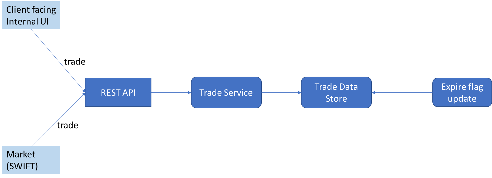

Overall Flow

Assumptions
- For the demonstration ConcurrentSkipListMap is used as the most suitable thread safe data store for the demo, in real-life scenarios this would be a proper relational database like MySQL or Oracle to manage better concurrency control and reliability. 
- API channel is assumed to receive thousands of trades to flow in JSON format for demonstration, in real-life these would be MT/ MX messages transferred using JMS over messaging systems like MQ or Kafka.
- Pipeline automation to higher environment is limited to UAT and NFT only as production will be a manual one post sign off from NFT and UAT.
- No reactive web interfaces are used as no specific requirements to display trades on UI.
- Not making any assumptions on low latency / faster startup, hence using SpringBoot without GraalVM support. If faster startup, low latency and scale is a MUST then Spring or Quarkus with GraalVM support is recommended.
- The application is assumed to be deployed on Kubernetes.